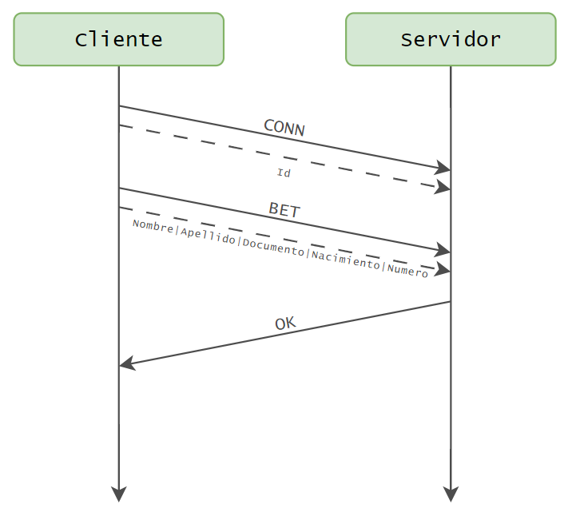
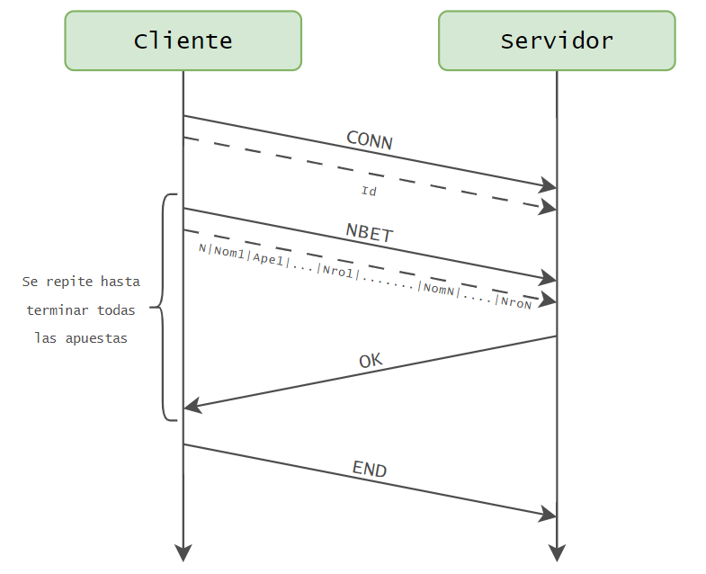
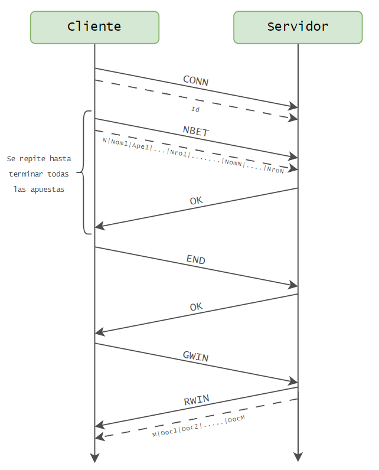

# TP0: Docker + Comunicaciones + Concurrencia

En el presente repositorio se provee un ejemplo de cliente-servidor el cual corre en containers con la ayuda de [docker-compose](https://docs.docker.com/compose/). El mismo es un ejemplo práctico brindado por la cátedra para que los alumnos tengan un esqueleto básico de cómo armar un proyecto de cero en donde todas las dependencias del mismo se encuentren encapsuladas en containers. El cliente (Golang) y el servidor (Python) fueron desarrollados en diferentes lenguajes simplemente para mostrar cómo dos lenguajes de programación pueden convivir en el mismo proyecto con la ayuda de containers.

Por otro lado, se presenta una guía de ejercicios que los alumnos deberán resolver teniendo en cuenta las consideraciones generales descriptas al pie de este archivo.

## Instrucciones de uso
El repositorio cuenta con un **Makefile** que posee encapsulado diferentes comandos utilizados recurrentemente en el proyecto en forma de targets. Los targets se ejecutan mediante la invocación de:

* **make \<target\>**:
Los target imprescindibles para iniciar y detener el sistema son **docker-compose-up** y **docker-compose-down**, siendo los restantes targets de utilidad para el proceso de _debugging_ y _troubleshooting_.

Los targets disponibles son:
* **docker-compose-up**: Inicializa el ambiente de desarrollo (buildear docker images del servidor y cliente, inicializar la red a utilizar por docker, etc.) y arranca los containers de las aplicaciones que componen el proyecto.
* **docker-compose-down**: Realiza un `docker-compose stop` para detener los containers asociados al compose y luego realiza un `docker-compose down` para destruir todos los recursos asociados al proyecto que fueron inicializados. Se recomienda ejecutar este comando al finalizar cada ejecución para evitar que el disco de la máquina host se llene.
* **docker-compose-logs**: Permite ver los logs actuales del proyecto. Acompañar con `grep` para lograr ver mensajes de una aplicación específica dentro del compose.
* **docker-image**: Buildea las imágenes a ser utilizadas tanto en el servidor como en el cliente. Este target es utilizado por **docker-compose-up**, por lo cual se lo puede utilizar para testear nuevos cambios en las imágenes antes de arrancar el proyecto.
* **build**: Compila la aplicación cliente para ejecución en el _host_ en lugar de en docker. La compilación de esta forma es mucho más rápida pero requiere tener el entorno de Golang instalado en la máquina _host_.

### Servidor
El servidor del presente ejemplo es un EchoServer: los mensajes recibidos por el cliente son devueltos inmediatamente. El servidor actual funciona de la siguiente forma:
1. Servidor acepta una nueva conexión.
2. Servidor recibe mensaje del cliente y procede a responder el mismo.
3. Servidor desconecta al cliente.
4. Servidor procede a recibir una conexión nuevamente.

### Cliente
El cliente del presente ejemplo se conecta reiteradas veces al servidor y envía mensajes de la siguiente forma.
1. Cliente se conecta al servidor.
2. Cliente genera mensaje incremental.
recibe mensaje del cliente y procede a responder el mismo.
3. Cliente envía mensaje al servidor y espera mensaje de respuesta.
Servidor desconecta al cliente.
4. Cliente verifica si aún debe enviar un mensaje y si es así, vuelve al paso 2.

Al ejecutar el comando `make docker-compose-up` para comenzar la ejecución del ejemplo y luego el comando `make docker-compose-logs`, se observan los siguientes logs:

```
client1  | 2024-08-21 22:11:15 INFO     action: config | result: success | client_id: 1 | server_address: server:12345 | loop_amount: 5 | loop_period: 5s | log_level: DEBUG
client1  | 2024-08-21 22:11:15 INFO     action: receive_message | result: success | client_id: 1 | msg: [CLIENT 1] Message N°1
server   | 2024-08-21 22:11:14 DEBUG    action: config | result: success | port: 12345 | listen_backlog: 5 | logging_level: DEBUG
server   | 2024-08-21 22:11:14 INFO     action: accept_connections | result: in_progress
server   | 2024-08-21 22:11:15 INFO     action: accept_connections | result: success | ip: 172.25.125.3
server   | 2024-08-21 22:11:15 INFO     action: receive_message | result: success | ip: 172.25.125.3 | msg: [CLIENT 1] Message N°1
server   | 2024-08-21 22:11:15 INFO     action: accept_connections | result: in_progress
server   | 2024-08-21 22:11:20 INFO     action: accept_connections | result: success | ip: 172.25.125.3
server   | 2024-08-21 22:11:20 INFO     action: receive_message | result: success | ip: 172.25.125.3 | msg: [CLIENT 1] Message N°2
server   | 2024-08-21 22:11:20 INFO     action: accept_connections | result: in_progress
client1  | 2024-08-21 22:11:20 INFO     action: receive_message | result: success | client_id: 1 | msg: [CLIENT 1] Message N°2
server   | 2024-08-21 22:11:25 INFO     action: accept_connections | result: success | ip: 172.25.125.3
server   | 2024-08-21 22:11:25 INFO     action: receive_message | result: success | ip: 172.25.125.3 | msg: [CLIENT 1] Message N°3
client1  | 2024-08-21 22:11:25 INFO     action: receive_message | result: success | client_id: 1 | msg: [CLIENT 1] Message N°3
server   | 2024-08-21 22:11:25 INFO     action: accept_connections | result: in_progress
server   | 2024-08-21 22:11:30 INFO     action: accept_connections | result: success | ip: 172.25.125.3
server   | 2024-08-21 22:11:30 INFO     action: receive_message | result: success | ip: 172.25.125.3 | msg: [CLIENT 1] Message N°4
server   | 2024-08-21 22:11:30 INFO     action: accept_connections | result: in_progress
client1  | 2024-08-21 22:11:30 INFO     action: receive_message | result: success | client_id: 1 | msg: [CLIENT 1] Message N°4
server   | 2024-08-21 22:11:35 INFO     action: accept_connections | result: success | ip: 172.25.125.3
server   | 2024-08-21 22:11:35 INFO     action: receive_message | result: success | ip: 172.25.125.3 | msg: [CLIENT 1] Message N°5
client1  | 2024-08-21 22:11:35 INFO     action: receive_message | result: success | client_id: 1 | msg: [CLIENT 1] Message N°5
server   | 2024-08-21 22:11:35 INFO     action: accept_connections | result: in_progress
client1  | 2024-08-21 22:11:40 INFO     action: loop_finished | result: success | client_id: 1
client1 exited with code 0
```

## Parte 1: Introducción a Docker
En esta primera parte del trabajo práctico se plantean una serie de ejercicios que sirven para introducir las herramientas básicas de Docker que se utilizarán a lo largo de la materia. El entendimiento de las mismas será crucial para el desarrollo de los próximos TPs.

### Ejercicio N°1:
Además, definir un script de bash `generar-compose.sh` que permita crear una definición de DockerCompose con una cantidad configurable de clientes.  El nombre de los containers deberá seguir el formato propuesto: client1, client2, client3, etc. 

El script deberá ubicarse en la raíz del proyecto y recibirá por parámetro el nombre del archivo de salida y la cantidad de clientes esperados:

`./generar-compose.sh docker-compose-dev.yaml 5`

Considerar que en el contenido del script pueden invocar un subscript de Go o Python:

```
#!/bin/bash
echo "Nombre del archivo de salida: $1"
echo "Cantidad de clientes: $2"
python3 mi-generador.py $1 $2
```

#### Resolución

Para este ejercicio, se desarrolló el script `generar-compose.sh`, el cual recibe dos parámetros:
- `<output_filename>`: nombre del archivo de salida
- `<clients_number>`: la cantidad de clientes que se deben incluir en la definición de Docker Compose

El modo de ejecución puede ser tanto de forma directa `./` (si se tienen permisos de ejecución), como utilizando `sh`
```
./generar-compose.sh <output_filename> <clients_number>
```
```
sh generar-compose.sh <output_filename> <clients_number>
```
Por ejemplo, si se desea que el archivo de salida se llame `docker-compose-dev-test.yaml` y configurar únicamente `2 (dos)` clientes, se debería usar el siguiente comando:
```
./generar-compose.sh docker-compose-dev-test.yaml 2
```
Cuyo resultado por pantalla sería 
```
Generating configuration file docker-compose-dev-test.yaml with 2 client(s)...
The file docker-compose-dev-test.yaml with 2 client(s) was generated successfully.
```

En caso de que no se proporcionen los parámetros necesarios, o si los parámetros proporcionados son insuficientes, el script mostrará el siguiente mensaje indicando cómo debe ejecutarse
```
Usage: ./generar-compose.sh <output_filename> <clients_number>
```

[Commit Ej 1](https://github.com/romeromaxi/tp0-distribuidos/tree/a4f37a09f10398e8084687c8b135035fcedeb4f6) (enlace al último commit correspondiente a la rama del ejercicio 1)


### Ejercicio N°2:
Modificar el cliente y el servidor para lograr que realizar cambios en el archivo de configuración no requiera un nuevo build de las imágenes de Docker para que los mismos sean efectivos. La configuración a través del archivo correspondiente (`config.ini` y `config.yaml`, dependiendo de la aplicación) debe ser inyectada en el container y persistida afuera de la imagen (hint: `docker volumes`).

#### Resolución
Para permitir que los cambios en los archivos de configuración (`config.ini` y `config.yaml`) sean efectivos sin necesidad de reconstruir las imágenes de Docker, se configuraron los `volumes` correspondientes dentro del archivo `docker-compose-dev.yaml`. Asegurando así que los cambios en estos archivos se reflejen en tiempo real en el contenedor sin necesidad de reconstruir la imagen.

Configuración para el `Servidor`:
```
volumes:
    - ./server/config.ini:/config.ini:ro
```

Mientras que para el `Cliente`:
```
volumes:
    - ./client/config.yaml:/config.yaml:ro
```
En ambos se utilizó la opción de `:ro` (read-only) para que sean tratados solamente como archivos de lectura, evitando posibles modificaciones.

Para realizar la prueba correspondiente se pueden ejecutar los contenedores (con el comando `make docker-compose-up`), luego modificar los archivos de configuración y ver como se actualizan los contenedores

[Commit Ej 2](https://github.com/romeromaxi/tp0-distribuidos/tree/5ee37c7f26024275dbf91f1fda9017a5432dee15) (enlace al último commit correspondiente a la rama del ejercicio 2)

### Ejercicio N°3:
Crear un script de bash `validar-echo-server.sh` que permita verificar el correcto funcionamiento del servidor utilizando el comando `netcat` para interactuar con el mismo. Dado que el servidor es un EchoServer, se debe enviar un mensaje al servidor y esperar recibir el mismo mensaje enviado.

En caso de que la validación sea exitosa imprimir: `action: test_echo_server | result: success`, de lo contrario imprimir:`action: test_echo_server | result: fail`.

El script deberá ubicarse en la raíz del proyecto. Netcat no debe ser instalado en la máquina _host_ y no se puede exponer puertos del servidor para realizar la comunicación (hint: `docker network`). `

#### Resolución 
Para este ejercicio, se desarrolló el script `validar-echo-server.sh` que verifica el funcionamiento del servidor utilizando `netcat`. Se puede ejecutar mediante el comando `sh` o de forma directa `./` (si se tienen permisos de ejecución).

Antes de ejecutar el script, se debe asegurar de que el servidor esté activo (`make docker-compose-up`)

```
./validar-echo-server.sh
```

A su vez se le pueden pasar dos parámetros por si se requiere configurar el puerto del servidor o cambiar el mensaje que se envia
```
./validar-echo-server.sh <port> <message>
```
Por ejemplo, si quere enviarse el mensaje `Test echo-server` pero se quiere seguir usando el puerto preestablecido (`12345`), puede ejecutarse el siguiente comando
```
./validar-echo-server.sh - "Test echo-server"
```

[Commit Ej 3](https://github.com/romeromaxi/tp0-distribuidos/tree/786792959906ba8e9814db461f42438ee87a3ff3) (enlace al último commit correspondiente a la rama del ejercicio 3)

### Ejercicio N°4:
Modificar servidor y cliente para que ambos sistemas terminen de forma _graceful_ al recibir la signal SIGTERM. Terminar la aplicación de forma _graceful_ implica que todos los _file descriptors_ (entre los que se encuentran archivos, sockets, threads y procesos) deben cerrarse correctamente antes que el thread de la aplicación principal muera. Loguear mensajes en el cierre de cada recurso (hint: Verificar que hace el flag `-t` utilizado en el comando `docker compose down`).

#### Resolución
Para garantizar que tanto el cliente como el servidor terminen de manera _graceful_ al recibir una señal `SIGTERM`, se realizaron las siguientes modificaciones:

##### Servidor
Se configuró el manejo de señales utilizando `signal.signal` en `Python`.Se estableció una función callback para manejar la señal `SIGTERM`, la cual se encarga de cerrar los recursos abiertos antes de que el servidor termine.

##### Cliente
Se implementó una `goroutine` para manejar la recepción de señales del sistema, que se captura con `signal.Notify`. Cuando se recibe `SIGTERM`, la `goroutine` es la encargada de cerrar todos los recursos abiertos.

Por otro lado, se incrementó el valor del `timeout` dentro del `docker-compose-down`, para garantizar que Docker espere a que los contenedores terminen de manera ordenada antes de deternelos.

Para poder realizar la prueba correspondiente se deben seguir los siguientes pasos
1. Levanta el cliente y el servidor utilizando el comando:
    ```
    make docker-compose-up
    ```

2. Termina la ejecución anticipadamente con:
    ```
    make docker-compose-down
    ```

[Commit Ej 4](https://github.com/romeromaxi/tp0-distribuidos/tree/c12025192de4beb760580c69232dcd8a15bba921) (enlace al último commit correspondiente a la rama del ejercicio 4)

## Parte 2: Repaso de Comunicaciones

Las secciones de repaso del trabajo práctico plantean un caso de uso denominado **Lotería Nacional**. Para la resolución de las mismas deberá utilizarse como base al código fuente provisto en la primera parte, con las modificaciones agregadas en el ejercicio 4.

### Protocolo de Comunicación
En los ejercicios siguientes, se utiliza un protocolo de comunicación basado en una estructura común. Este protocolo establece que, antes de enviar el contenido de un mensaje, primero se debe comunicar el `Tipo de Mensaje`. Para ello, se emplean códigos predefinidos que, al ser enviados, deben ocupar exactamente `4 bytes`. Este formato uniforme asegura que todos los códigos tengan la misma longitud (en bytes), evitando problemas de lectura, ya que se espera siempre un tamaño fijo para el tipo de mensaje.

Una vez recibido el `Tipo de Mensaje`, se puede identificar la estructura del siguiente mensaje, si es necesario. Este segundo mensaje incluye un encabezado de `4 bytes` en formato `BigEndian`, que indica la longitud en bytes del payload (el contenido restante del mensaje). Esto permite saber cuántos bytes se deben leer para recibir el mensaje completo.

El payload se envía como una cadena de texto codificada en `UTF-8`. Si el mensaje contiene varios datos, estos se separan con el delimitador `|`. Este delimitador se eligió tras revisar los archivos de prueba en `./data/dataset.zip`, asegurando que el carácter `|` no aparece en ninguno de ellos.

#### Tipos de Mensajes
Los códigos para los diferentes tipos de mensajes en el protocolo son los siguientes:

##### **Enviados por el Cliente**:
- `CONN`: Después de establecer la conexión, el cliente envía este mensaje para comunicar al servidor su *Id de Agencia*. Esto permite al servidor identificar el origen de cada mensaje sin necesidad de incluir esta información en otros (reduciendo su tamaño y procesamiento)
    - Payload: `Id de Agencia`
- `BET`: para indicarle al servidor que quiere realizar una apuesta.
    - Payload: conformado por cada una de los campos necesarios para realizar una apuesta, separados por el caracter delimitador definido. El orden de los campos es `NOMBRE|APELLIDO|DOCUMENTO|NACIMIENTO|NUMERO`
- `NBET`: le avisa al servidor que enviará un conjunto de apuestas en un solo mensaje (procesamiento en _batchs_)
    - Payload: el primer campo corresponde a la cantidad de apuestas que tiene el mensaje, seguidos por todos los campos de cada apuesta (como para el mensaje `BET`). Por ejemplo, en el caso de `2 (dos)` apuestas: `2|NOM_1|APE_1|DOC_1|NAC_1|NRO_1|NOM_2|APE_2|DOC_2|NAC_2|NRO_2`
- `END`: se utiliza cuando el cliente (agencia de apuestas) ha terminado de enviar todas las apuestas correspondientes.
    - Payload: no aplica
- `GWIN`: le solicita al servidor los resultados del sorteo para obtener los ganadores
    - Payload: no aplica

##### **Enviados por el Servidor**:
- `OK`: le informa al cliente en cuestión que la acción solicitada se completó con éxito. Este mensaje puede referirse a la realización de una apuesta, al procesamiento de varias apuestas en batch, o a la finalización de todas las apuestas del cliente.
    - Payload: no aplica
- `NOK`: le indica al cliente que ocurrió un error durante la ejecución de la acción solicitada. Es la respuesta opuesta al mensaje `OK`
    - Payload: no aplica
- `NEND`: para comunicarle al cliente que debe esperar para obtener los ganadores del sorteo, ya que algunas agencias aún no han completado la carga de apuestas. Esto es una respuesta al mensaje `GWIN`, en el caso que el sorteo no haya terminado
    - Payload: no aplica
- `RWIN`: le notifica al cliente que puede obtener los resultados del sorteo, los cuales se comunicarán en el siguiente mensaje (respuesta a `GWIN` cuando el sorteo si ha  finalizado)
    - Payload: el primer campo corresponde a la cantidad de ganadores, seguido por cada uno de los documentos. Para el caso de `3 (tres)` ganadores sería: `3|DOC_1|DOC_2|DOC_3`


### Ejercicio N°5:
Modificar la lógica de negocio tanto de los clientes como del servidor para nuestro nuevo caso de uso.

#### Cliente
Emulará a una _agencia de quiniela_ que participa del proyecto. Existen 5 agencias. Deberán recibir como variables de entorno los campos que representan la apuesta de una persona: nombre, apellido, DNI, nacimiento, numero apostado (en adelante 'número'). Ej.: `NOMBRE=Santiago Lionel`, `APELLIDO=Lorca`, `DOCUMENTO=30904465`, `NACIMIENTO=1999-03-17` y `NUMERO=7574` respectivamente.

Los campos deben enviarse al servidor para dejar registro de la apuesta. Al recibir la confirmación del servidor se debe imprimir por log: `action: apuesta_enviada | result: success | dni: ${DNI} | numero: ${NUMERO}`.


#### Servidor
Emulará a la _central de Lotería Nacional_. Deberá recibir los campos de la cada apuesta desde los clientes y almacenar la información mediante la función `store_bet(...)` para control futuro de ganadores. La función `store_bet(...)` es provista por la cátedra y no podrá ser modificada por el alumno.
Al persistir se debe imprimir por log: `action: apuesta_almacenada | result: success | dni: ${DNI} | numero: ${NUMERO}`.

#### Comunicación:
Se deberá implementar un módulo de comunicación entre el cliente y el servidor donde se maneje el envío y la recepción de los paquetes, el cual se espera que contemple:
* Definición de un protocolo para el envío de los mensajes.
* Serialización de los datos.
* Correcta separación de responsabilidades entre modelo de dominio y capa de comunicación.
* Correcto empleo de sockets, incluyendo manejo de errores y evitando los fenómenos conocidos como [_short read y short write_](https://cs61.seas.harvard.edu/site/2018/FileDescriptors/).


#### Resolución
Para este ejercicio, se añadieron `5 (cinco)` clientes al archivo DockerCompose. Cada cliente tiene definidas las siguientes variables de entorno, que proporcionan los datos necesarios para realizar una apuesta:
- `CLI_BET_NAME`: nombre de la persona que realiza la apuesta
- `CLI_BET_SURNAME`: apellido de la persona que realiza la apuesta
- `CLI_BET_DNI`: documento de la persona que realiza la apuesta
- `CLI_BET_BIRTH`: fecha de nacimiento de la persona que realiza la apuesta
- `CLI_BET_NUMBER`: número de la apuesta

En este caso se utilizaron solamente los mensajes de 
- `CONN`
- `BET`
- `OK`

##### Pasos

En este punto el flujo es el siguiente:
1. El `Cliente` envía el mensaje de conexión `CONN`, y luego su número de agencia (`Id`)

2. Inmediatamente después, el `Cliente` envía el mensaje `BET` y luego los datos necesarios para realizar una apuesta

3. El `Servidor`, al recibir la apuesta, la almacena y le responde de forma satisfactoria al `Cliente` con el mensaje de `OK`


De forma gráfica se vería

<div align="center">
    
</div>

##### Ejecución
Para poder correr este ejercicio basta con ejecutar el siguiente comando:
```
make docker-compose-up
```

[Commit Ej 5](https://github.com/romeromaxi/tp0-distribuidos/tree/8349a56457d0f3454d3a553003350fcb5d76e7c8) (enlace al último commit correspondiente a la rama del ejercicio 5)

### Ejercicio N°6:
Modificar los clientes para que envíen varias apuestas a la vez (modalidad conocida como procesamiento por _chunks_ o _batchs_). La información de cada agencia será simulada por la ingesta de su archivo numerado correspondiente, provisto por la cátedra dentro de `.data/datasets.zip`.
Los _batchs_ permiten que el cliente registre varias apuestas en una misma consulta, acortando tiempos de transmisión y procesamiento.

En el servidor, si todas las apuestas del *batch* fueron procesadas correctamente, imprimir por log: `action: apuesta_recibida | result: success | cantidad: ${CANTIDAD_DE_APUESTAS}`. En caso de detectar un error con alguna de las apuestas, debe responder con un código de error a elección e imprimir: `action: apuesta_recibida | result: fail | cantidad: ${CANTIDAD_DE_APUESTAS}`.

La cantidad máxima de apuestas dentro de cada _batch_ debe ser configurable desde config.yaml. Respetar la clave `batch: maxAmount`, pero modificar el valor por defecto de modo tal que los paquetes no excedan los 8kB. 

El servidor, por otro lado, deberá responder con éxito solamente si todas las apuestas del _batch_ fueron procesadas correctamente.

#### Resolución
Para este ejercicio, los `5 (cinco)` clientes definidos en el archivo DockerCompose ya no cuentan con las variables de entorno relacionadas a las apuestas.

En su lugar, se agregó en cada cliente la configuración de `volumes`, desde donde el cliente leerá las apuestas que debe procesar:
```
volumes:
    - ./client/config.yaml:/config.yaml:ro
    - ./.data/dataset/agency-1.csv:/agency.csv:ro
```
Por otro lado, en el archivo de configuración (`client/config.yaml`) se modificó el valor de `batch.maxAmount`, limitando el envío de cada batch a menos de 100 apuestas, con el objetivo de que los paquetes no superen los 8kB.

Además, se agregaron nuevas configuraciónes `file.name` y `file.delimiter`, que especifican el nombre del archivo que el cliente debe leer y el carácter delimitador de campos dentro de este archivo.

En este caso se utilizaron solamente los mensajes de 
- `CONN`
- `NBET`
- `OK`
- `NOK`
- `END`

Aunque el servidor podría seguir reconociendo un paquete del tipo `BET`.

##### Pasos

En este punto el flujo es el siguiente:
1. El `Cliente` envía el mensaje de conexión `CONN`, y luego su número de agencia (`Id`).

2. Inmediatamente después, el `Cliente` envía el mensaje `NBET` con una cierta cantidad de apuestas, en un proceso _batch_.

3. El `Servidor` recibe las apuestas, las decodifica y las almacena. Si no se produce ningún error en este proceso, responde al `Cliente` con el mensaje de `OK`. Si se produjo un error, le enviará el correspondiente `NOK`. 

4. Si el `Cliente`  tiene apuestas pendientes por enviar, vuelve al _Paso 2_.

5. Una vez que el `Cliente` ha enviado todas las apuestas, comunica la finalización de la carga con el mensaje `END`.


De forma gráfica se vería

<div align="center">
    
</div>


##### Ejecución
Para una correcta ejecución se deben seguir estos pasos:
1. Extraer los archivos de las apuestas de `./data/dataset.zip`, y colocarlos dentro de `./data/dataset/`.

2. Ejecutar el siguiente comando:
    ```
    make docker-compose-up
    ```

[Commit Ej 6](https://github.com/romeromaxi/tp0-distribuidos/tree/0232257ba43453edb91174626b76a9aaaf929abb) (enlace al último commit correspondiente a la rama del ejercicio 6)


### Ejercicio N°7:
Modificar los clientes para que notifiquen al servidor al finalizar con el envío de todas las apuestas y así proceder con el sorteo.
Inmediatamente después de la notificacion, los clientes consultarán la lista de ganadores del sorteo correspondientes a su agencia.
Una vez el cliente obtenga los resultados, deberá imprimir por log: `action: consulta_ganadores | result: success | cant_ganadores: ${CANT}`.

El servidor deberá esperar la notificación de las 5 agencias para considerar que se realizó el sorteo e imprimir por log: `action: sorteo | result: success`.
Luego de este evento, podrá verificar cada apuesta con las funciones `load_bets(...)` y `has_won(...)` y retornar los DNI de los ganadores de la agencia en cuestión. Antes del sorteo, no podrá responder consultas por la lista de ganadores.
Las funciones `load_bets(...)` y `has_won(...)` son provistas por la cátedra y no podrán ser modificadas por el alumno.

#### Resolución
Para este ejercicio, se mantienen los `5 (cinco)` clientes definidos en el archivo DockerCompose del ejercicio anterior. Además, se ha añadido una nueva variable de entorno en el servidor llamada`NUMBER_AGENCIES`, que indica la cantidad de agencias por las que se debe esperar para poder finalizar el sorteo.


En este caso se utilizaron solamente los mensajes de 
- `CONN`
- `NBET`
- `OK`
- `NOK`
- `END`
- `GWIN`
- `NEND`
- `RWIN`

Aunque el servidor podría seguir reconociendo un paquete del tipo `BET`.

##### Pasos

En este punto el flujo es el siguiente:
1. El `Cliente` envía el mensaje de conexión `CONN`, y luego su número de agencia (`Id`).

2. A continuación, el `Cliente` envía el mensaje `NBET` con una lote de apuestas, en un proceso _batch_.

3. El `Servidor` recibe las apuestas, las decodifica y las almacena. Si no se produce ningún error en este proceso, responde al `Cliente` con el mensaje de `OK`. Si se produjo un error, le enviará el correspondiente `NOK`. 

4. Si el `Cliente`  tiene apuestas pendientes por enviar, vuelve al _Paso 2_.

5. Una vez que el `Cliente` ha enviado todas las apuestas, comunica la finalización de la carga con el mensaje `END`.

6. A lo que el `Servidor` registra que dicha agencia terminó, y devuelve el mensaje de estado correspondiente (`OK` si se realizó con éxito, o `NOK` si ocurrió algún imprevisto).

7. Inmediatamente después de recibir la confirmación de éxito, el `Cliente`, le solicita al `Servidor` por los ganadores del sorteo.
    - Si el sorteo ha finalizado, el `Servidor`consulta por todos los ganadores dentro de esta agencia, y responde con el mensaje `RWIN`.
    - Si el sorteo aún no ha terminado, el `Cliente` se desconecta por unos instantes, luego vuelve a establecer comunicación con el `Servidor`, enviando nuevamente el mensaje `CONN`, y repitiendo el _Paso 7_.


De forma gráfica se vería

<div align="center">
    
</div>


##### Ejecución
Para una correcta ejecución se deben seguir estos pasos:
1. Extraer los archivos de las apuestas de `./data/dataset.zip`, y colocarlos dentro de `./data/dataset/`.

2. Ejecutar el siguiente comando:
    ```
    make docker-compose-up
    ```

[Commit Ej 7](https://github.com/romeromaxi/tp0-distribuidos/tree/dfb0c5d354b2b06adfebe4849aba084102d5121e) (enlace al último commit correspondiente a la rama del ejercicio 7)


## Parte 3: Repaso de Concurrencia

### Ejercicio N°8:
Modificar el servidor para que permita aceptar conexiones y procesar mensajes en paralelo.
En este ejercicio es importante considerar los mecanismos de sincronización a utilizar para el correcto funcionamiento de la persistencia.

En caso de que el alumno implemente el servidor Python utilizando _multithreading_,  deberán tenerse en cuenta las [limitaciones propias del lenguaje](https://wiki.python.org/moin/GlobalInterpreterLock).

#### Resolución
En este ejercicio, se decidió implementar el servidor utilizando _multithreading_. Al aceptar una conexión de un cliente, se crea un nuevo thread para manejar las solicitudes y mensajes de dicho cliente, lo que permite procesar múltiples conexiones en paralelo. Aunque el `Global Interpreter Lock (GIL)` de Python limita la ejecución paralela de operaciones en CPU, en este caso no genera inconvenientes, ya que la mayoría de las operaciones que realiza el servidor son de I/O (como la lectura y escritura en archivos), las cuales no están bloqueadas por el `GIL`. Esto permite que el servidor acepte conexiones y procese mensajes de manera concurrente de forma eficiente.

Para garantizar la correcta sincronización, se emplearon dos mecanismos de locks:
- Un _lock_ sobre el archivo de apuestas, utilizado tanto para las operaciones de escritura (`store_bets`) como de lectura (`load_bets`), asegurando que el acceso concurrente al archivo no cause inconsistencias.
- Otro _lock_ que se utiliza para almacenar las agencias que confirmaron haber finalizado sus apuestas, evitando problemas de concurrencia al actualizar esta información en paralelo.

[Commit Ej 8](https://github.com/romeromaxi/tp0-distribuidos/tree/3b3a6cb717f8a26573873f7c479a1281d3a80468) (enlace al último commit correspondiente a la rama del ejercicio 8)

## Consideraciones Generales
Se espera que los alumnos realicen un _fork_ del presente repositorio para el desarrollo de los ejercicios.El _fork_ deberá contar con una sección de README que indique como ejecutar cada ejercicio.

La Parte 2 requiere una sección donde se explique el protocolo de comunicación implementado.
La Parte 3 requiere una sección que expliquen los mecanismos de sincronización utilizados.

Cada ejercicio deberá resolverse en una rama independiente con nombres siguiendo el formato `ej${Nro de ejercicio}`. Se permite agregar commits en cualquier órden, así como crear una rama a partir de otra, pero al momento de la entrega deben existir 8 ramas llamadas: ej1, ej2, ..., ej7, ej8.

(hint: verificar listado de ramas y últimos commits con `git ls-remote`)

Puden obtener un listado del último commit de cada rama ejecutando `git ls-remote`.

Finalmente, se pide a los alumnos leer atentamente y **tener en cuenta** los criterios de corrección provistos [en el campus](https://campusgrado.fi.uba.ar/mod/page/view.php?id=73393).
